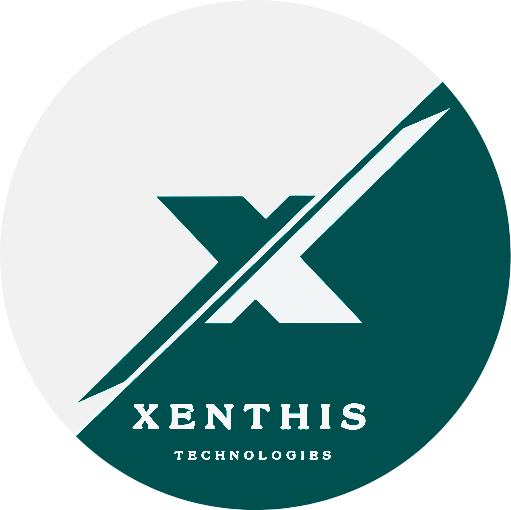

# Xenthis Technologies Website



Welcome to the official repository for the **Xenthis Technologies** corporate website. This project showcases our commitment to "Define, Design, and Deploy" innovative technology solutions. The website is a responsive, single-page application featuring modern design aesthetics, interactive animations, and a comprehensive overview of our services.

## 🚀 Usage & Features

The website provides a seamless user experience with the following key features:

*   **Immersive Loading Experience**: A custom percentage-based loader with dynamic messaging ("Turning... Ideas... Into... Impact...") to engage users from the start.
*   **Responsive Navigation**: A sticky navbar that adapts on scroll, updates active links automatically, and includes smooth scrolling for all anchor links.
*   **Interactive Services**: detailed service descriptions (Software, Hardware, AI & ML, Design) presented in interactive modal popups.
*   **Dynamic Animations**:
    *   **Animate.css Integration**: Elements slide, fade, and zoom in as you scroll.
    *   **Particle Effects**: Subtle background particle animations for a modern tech feel.
    *   **Hover Effects**: Buttons and cards react to user interaction.
*   **Project Counter**: Animated statistic counters showing our project milestones.
*   **Direct Contact Integration**:
    *   **QR Code**: A scannable QR code for quick access to our Google Form contact page.
    *   **WhatsApp Float**: A floating button for instant messaging via WhatsApp.
    *   **Contact Form**: A functional-looking contact form form (frontend validation included).

## 🛠️ Technologies Used

This project is built using standard web technologies:

*   **HTML5**: Semantic markup for structure.
*   **CSS3**: Custom styling with gradients, animations, and responsive layouts.
*   **JavaScript (ES6+)**: Logic for the loader, scroll effects, particles, and interactivity.
*   **Bootstrap 5**: Responsive grid system, modals, and navbar components.
*   **Animate.css**: Pre-built cross-browser animations.
*   **Font Awesome**: Vector icons for UI elements.
*   **Google Fonts**: Typography (Poppins & Montserrat).

## 📂 Project Structure

```
xenthis-website/
├── index.html          # Main HTML structure
├── styles.css          # Core styles, animations, and overrides
├── script.js           # Interactive logic (loader, scroll, features)
├── logo.png            # Company logo asset
├── Xenthis-contact.png # QR Code image asset
├── about.gif           # Animated asset for About section
├── ai&ml.png           # Feature image for AI/ML modal
└── README.md           # Project documentation
```

## ⚙️ Installation & Setup

To view or edit this project locally, follow these steps:

1.  **Clone the Repository**:
    ```bash
    git clone https://github.com/SanjeevSanju1311/xenthis-website.git
    cd xenthis-website
    ```

2.  **Open the Application**:
    *   Simply double-click `index.html` to open it in your default web browser.
    *   **Recommended**: Use a local development server (like Live Server in VS Code) for the best experience with asset loading.

## 🎨 Customization

*   **Colors & Fonts**: Edit `styles.css` variables or specific classes to change the color scheme or typography.
*   **Content**: Update `index.html` to modify text, images, or add new sections.
*   **Animations**: Tweak animation timings or types in `script.js` or by changing `Animate.css` classes in HTML.

## 🤝 Contact

**Xenthis Technologies**
*   📍 **Location**: Pollachi, Tamil Nadu, India
*   📧 **Email**: [xenthistechnologies@gmail.com](mailto:xenthistechnologies@gmail.com)
*   📞 **Phone**: +91 9944597940 || +91 8838903584
*   🔗 **Connect**: [LinkedIn](https://www.linkedin.com/in/xenthis-technology-970451380) | [Instagram](https://www.instagram.com/xenthis.tech)
